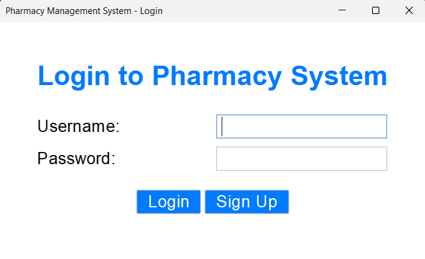
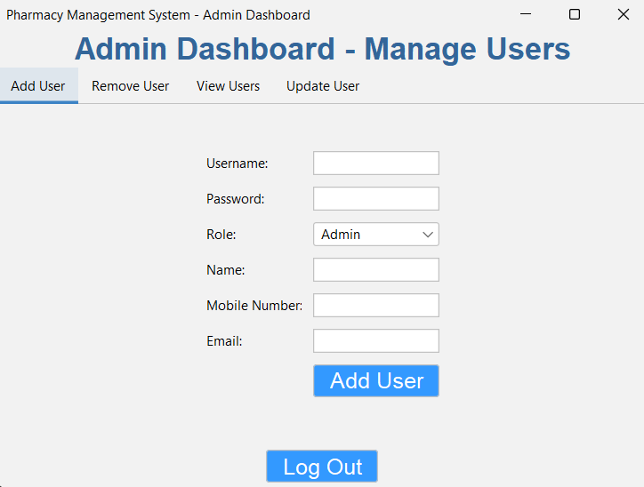
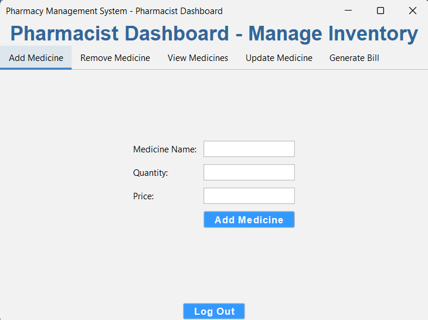

# Pharmacy-Management-System
 Pharmacy Management System is a Java project developed in Eclipse IDE using Java Swing for the GUI. It features a secure login page, an Admin Dashboard for managing users and inventory, and a Pharmacist Dashboard for handling prescriptions and sales. This system simplifies pharmacy operations with an intuitive interface.
## Table of Contents
1. [Features](#features)
2. [Technologies Used](#technologies-used)
3. [Installation](#installation)
4. [Usage](#usage)
5. [Screenshots](#screenshots)
6. [License](#license)
## Features
- Secure login system.
- Admin Dashboard for user and inventory management.
- Pharmacist Dashboard for prescription and sales handling.
- Intuitive and responsive interface using Java Swing.
## Technologies Used
- **Java** (Core and Swing)
- **Eclipse IDE**
- **SQL** for database management
## Installation
1. Clone the repository:
   ```bash
   git clone https://github.com/your-username/pharmacy-management-system.git
## Usage  

Follow these steps to use the **Pharmacy Management System**:  

### 1. Launch the Application  
Run the application using Eclipse IDE or your preferred Java runtime environment. The application will start with the login page.  

### 2. Login  
- **Admin Login**:  
  Use admin credentials to access the Admin Dashboard.  
- **Pharmacist Login**:  
  Use pharmacist credentials to access the Pharmacist Dashboard.  

### 3. Admin Dashboard  
Once logged in as an Admin, you can:  
- Manage user accounts (add, update, delete).  
- Update and monitor the inventory.  
- View system logs (if applicable).  

### 4. Pharmacist Dashboard  
As a Pharmacist, you can:  
- Handle prescription records.  
- Process sales and generate invoices.  
- View stock availability in real-time.  

### 5. Logout  
Click the **Logout** button on the dashboard to return to the login page.  

**Note**: Ensure the database is running to avoid connectivity issues.  

## Screenshots
### Login Page

### Admin Dashboard

### Pharmacist Dashboard


